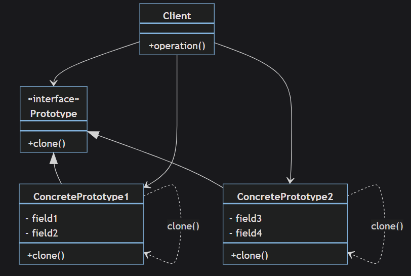

## 1. **_Phân loại_**

+ Creational Pattern

## 2. **_Ý nghĩa_**
 - Sao chép các đối tượng, tạo ra bản sao của đối tượng đã tồn tại
 - Tiết kiệm chi phí tạo mới đối tượng, che giấu logic khởi tạo đối tượng
## 4. **_Ứng dụng_**
+ Thường được sử dụng để sao chép các đối tượng phức tạp giống nhau

## 5. **_Cấu Trúc_**

## 6. Các thành phần trong mô hình:

### Prototype :
Định nghĩa một khuôn mẫu (interface) của các đối tượng có phương thức clone()
### ConcretePrototype:
Các lớp được cài đặt phương thức clone