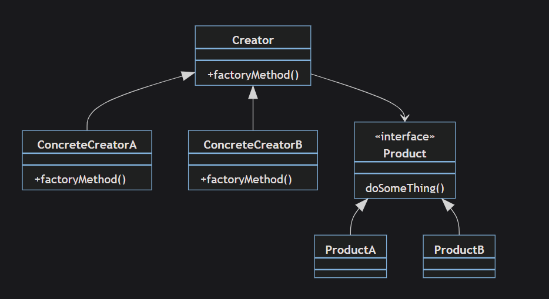
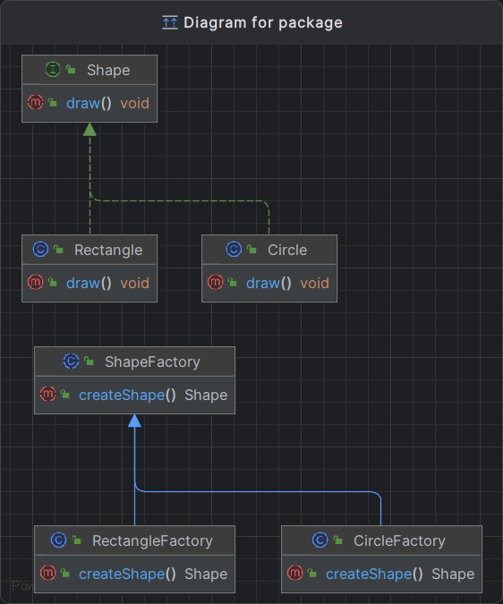

## 1. **_Phân loại_**

+ Creational Pattern

## 2. **_Ý nghĩa_**

+ Đích thị là một nhà máy tạo ra các đối tượng
+ Dễ thay đổi cách tạo ra các đối tượng của lớp bằng cách triển khai lại method ở factory
+ => không ảnh hưởng đến client code
+ Kiểm tra và quản lý các đối tượng được tạo ra một cách linh hoạt hơn
+ Đóng gói che giấu logic của việc khởi tạo hệ thống
+ Có thể tạo ra các đối tượng theo cách chung chung mà không cần chỉ định lớp cụ thể
## 4. **_Ứng dụng_**
 + Được sử dụng rộng rãi trong thiết kế phần mềm do tính linh hoạt và khả năng mở rộng cho hệ thống bằng cách tách biệt quá trình khởi tạo đối tượng

## 5. **_Cấu Trúc_**

## 6. Các thành phần trong mô hình:

### Product : 
   Định nghĩa một khuôn mẫu (interface) của các đối tượng mà factory method tạo ra.
### Concreteproduct: 
   các lớp được cài đặt khuôn mẫu product.
### Creator:
   Khai báo factory method, trả về kiểu đối tượng thuộc kiểu product. 
   Creator cũng có thể định nghĩa một cài đặt mặc định của factory method mà giá trị trả về là một đối tượng concreteproduct mặc định.
* Gọi factory method để tạo đổi tượng kiểu product.
* ConcreteCrator: ghi đè factory method để trả về một instance của concreteproduct.
## Ví dụ

#### Product : Shape 
#### ConcreteProduct: Rectangle
#### ConcreteProduct: Circle
#### Creator: ShapeFactory
#### ConcreteCreator: RectangleFactory 
#### ConcreteCreator: CircleFactory